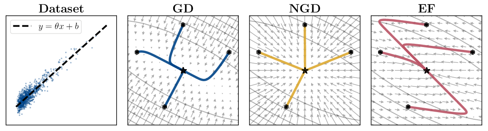
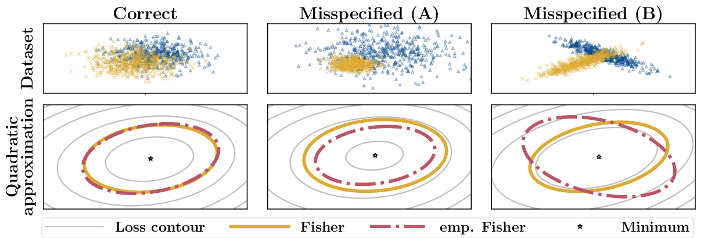
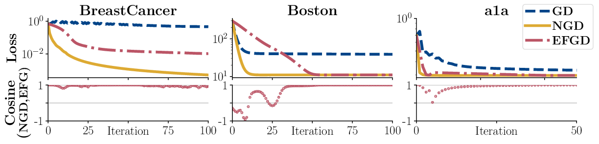

# Limitations of the empirical Fisher approximation: Code

This repository contains code to reproduce the experiments in
> **Limitations of the empirical Fisher approximation**<br/>
> Frederik Kunstner, Lukas Balles and Philipp Hennig<br/>
> [arxiv.org/TBD](arxiv.org/TBD)

<p align="center">



</p>

**Go to**
* [Installation](#installation)
* [Usage](#usage)
* [Known issues](#known-issues)

---

### Installation 

* **Main files:** Download the repository and install the modules in the `libs` folder:

  ```
  mkdir limitation-ef
  git clone https://github.com/fKunstner/limitations-empirical-fisher.git limitation-ef
  cd limitation-ef/libs/eftk
  pip install .
  cd ../efplt
  pip install .
  ```

* **Dependencies:** Install through `pip install [x]`:

  [`numpy`](https://www.numpy.org), [`scipy`](https://scipy.org/), [`matplotlib`](https://matplotlib.org/),
  [`scikit-learn`](https://scikit-learn.org/stable/install.html)
  and [`tqdm`](https://github.com/tqdm/tqdm).

* **Datasets:** the content of [datasets.zip](URL needs fixing) should be stored `~/data`,<br/>
  (or `eftk/datasets.py` edited for another location)

---

### Usage

The main file to run the experiment is `experiments/main.py`.

Calling `python experiments/main.py -h` should output the following help:
```
usage: main.py [-h] (-misspec | -optim | -vecfield) [-run] [-plot] [-appendix]
               [-save] [-show]

Experiment Runner

optional arguments:
  -h, --help  show this help message and exit

Experiment selection:
  -misspec    Misspecification experiment
  -optim      Optimization experiment
  -vecfield   Vector field visualization

Action selection:
  At least one of [-run, -plot] is required

  -run        Runs the experiment and save results as a .pk file
  -plot       Plots the result from a .pk file (requires -save and/or -show)
  -appendix   Also run/plot the experiments in the appendix

Plotting options:
  At least one of [-save, -show] is required if plotting

  -save       Save the plots
  -show       Show the plots
```

**TL;DR:**
```
typical use: $ python main.py -expName -run -plot -show

  (-misspec | -optim | -vecfield)   Choose experiment
  -run                              Run expensive computations (grid search) and save results
  -plot (-show | -save)             Plot results and (show or save) plots
  -appendix                         Run additional experiments
```` 


* **`-vecfield` experiment (Fig. 1):** `-run` needed, but short (~10min)
  ```
  python main.py -vecfield -plot -show
  ```
* **`-misspec` experiment (Fig. 2):** `-run` not needed
  ```
  python main.py -misspec -plot -show
  ```
* **`-optim` experiment (Fig. 3)** `-run` needed, large grid search (~2hours)
  ```
  python main.py -optim -run
  python main.py -optim -plot -show
  ```
* **`-appendix` (Fig. 4, 5, 6)**
  ```
  python main.py -misspec -plot -show -appendix
  python main.py -optim -run -plot -show -appendix
  ```

---

### Known issues

* Plotting needs a working Latex installation (the figures use Matplotlib's Latex backend)
* On Ubuntu, you might need to install `apt-get install dvipng`
